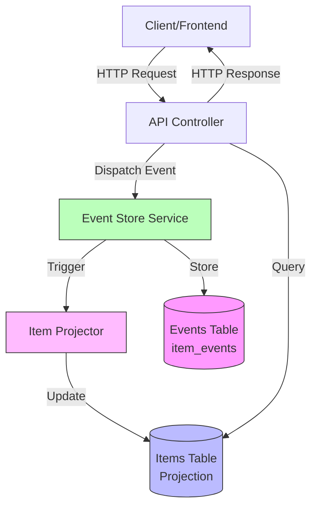
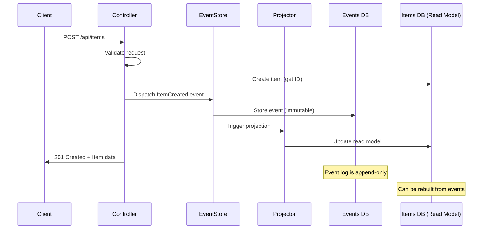
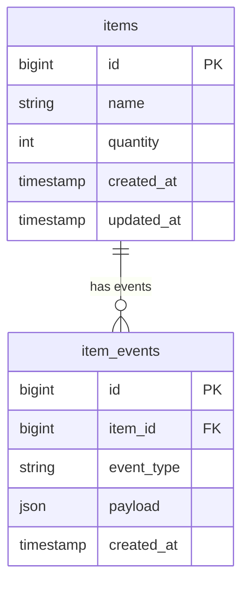
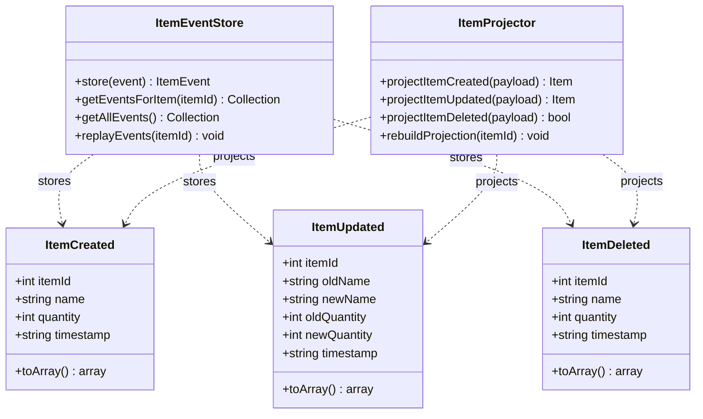

# Inventory Management System - Backend API

A RESTful API for managing inventory items with **Event Sourcing** architecture. Built with Laravel 12.x and SQLite.

## 🏗️ Architecture

This implementation uses **Event Sourcing** to track all changes to inventory items as immutable events. Instead of just updating records, every state change (create, update, delete) is stored as an event. The current state is maintained as a projection/read model for fast queries.

### Benefits
- Complete audit trail of all operations
- Ability to replay events to rebuild state
- Time-travel debugging capabilities
- Event history API endpoint for transparency

## 📐 Architecture Diagrams

### System Architecture



### Event Sourcing Flow



### Database Schema



### Event Types



## 📋 Requirements

- PHP 8.2+
- Composer
- SQLite (or MySQL/PostgreSQL)
- DDEV (optional, for local development)

## 🚀 Installation

### 1. Clone the repository
```bash
git clone <repository-url>
cd rbc-backend
```

### 2. Install dependencies
```bash
composer install
```

### 3. Configure environment
```bash
cp .env.example .env
php artisan key:generate
```

### 4. Configure database
The project is configured to use SQLite by default. The database file will be created automatically.

For MySQL/PostgreSQL, update your `.env` file:
```env
DB_CONNECTION=mysql
DB_HOST=127.0.0.1
DB_PORT=3306
DB_DATABASE=your_database
DB_USERNAME=your_username
DB_PASSWORD=your_password
```

### 5. Run migrations
```bash
php artisan migrate
```

### 6. Seed the database (optional)
```bash
php artisan db:seed
```

This will create 10 sample inventory items with proper event sourcing.

### 7. Start the development server
```bash
php artisan serve
```

The API will be available at `http://localhost:8000`

## 📡 API Endpoints

### Base URL
```
http://localhost:8000/api
```

### Endpoints

| Method | Endpoint | Description | Status Codes |
|--------|----------|-------------|--------------|
| GET | `/items` | Retrieve all inventory items | 200 OK |
| POST | `/items` | Create a new item | 201 Created, 422 Unprocessable Entity |
| GET | `/items/:id` | Retrieve a specific item | 200 OK, 404 Not Found |
| PUT/PATCH | `/items/:id` | Update an existing item | 200 OK, 404 Not Found, 422 Unprocessable Entity |
| DELETE | `/items/:id` | Delete an item | 204 No Content, 404 Not Found |
| GET | `/items/:id/events` | Get event history for item | 200 OK, 404 Not Found |

### Data Structure

Each item has the following properties:
- `id` (integer, unique) - Auto-generated
- `name` (string, required, max 255 chars)
- `quantity` (integer, required, non-negative)
- `created_at` (timestamp)
- `updated_at` (timestamp)

## 📝 API Examples

### Get all items
```bash
curl http://localhost:8000/api/items
```

**Response (200 OK):**
```json
[
  {
    "id": 1,
    "name": "Laptop",
    "quantity": 10,
    "created_at": "2026-01-22T00:00:00.000000Z",
    "updated_at": "2026-01-22T00:00:00.000000Z"
  }
]
```

### Create a new item
```bash
curl -X POST http://localhost:8000/api/items \
  -H "Content-Type: application/json" \
  -d '{
    "name": "Wireless Mouse",
    "quantity": 25
  }'
```

**Response (201 Created):**
```json
{
  "id": 2,
  "name": "Wireless Mouse",
  "quantity": 25,
  "created_at": "2026-01-22T08:30:00.000000Z",
  "updated_at": "2026-01-22T08:30:00.000000Z"
}
```

### Get a specific item
```bash
curl http://localhost:8000/api/items/1
```

**Response (200 OK):**
```json
{
  "id": 1,
  "name": "Laptop",
  "quantity": 10,
  "created_at": "2026-01-22T00:00:00.000000Z",
  "updated_at": "2026-01-22T00:00:00.000000Z"
}
```

### Update an item
```bash
curl -X PUT http://localhost:8000/api/items/1 \
  -H "Content-Type: application/json" \
  -d '{
    "name": "Gaming Laptop",
    "quantity": 15
  }'
```

**Response (200 OK):**
```json
{
  "id": 1,
  "name": "Gaming Laptop",
  "quantity": 15,
  "created_at": "2026-01-22T00:00:00.000000Z",
  "updated_at": "2026-01-22T08:35:00.000000Z"
}
```

### Delete an item
```bash
curl -X DELETE http://localhost:8000/api/items/1
```

**Response (204 No Content)**

### Get event history for an item
```bash
curl http://localhost:8000/api/items/1/events
```

**Response (200 OK):**
```json
[
  {
    "id": 1,
    "item_id": 1,
    "event_type": "ItemCreated",
    "payload": {
      "item_id": 1,
      "name": "Laptop",
      "quantity": 10,
      "timestamp": "2026-01-22T00:00:00+00:00"
    },
    "created_at": "2026-01-22T00:00:00.000000Z"
  },
  {
    "id": 2,
    "item_id": 1,
    "event_type": "ItemUpdated",
    "payload": {
      "item_id": 1,
      "old_name": "Laptop",
      "new_name": "Gaming Laptop",
      "old_quantity": 10,
      "new_quantity": 15,
      "timestamp": "2026-01-22T08:35:00+00:00"
    },
    "created_at": "2026-01-22T08:35:00.000000Z"
  }
]
```

## ⚠️ Error Handling

### Validation Error (422)
```json
{
  "message": "The name field is required. (and 1 more error)",
  "errors": {
    "name": ["The name field is required."],
    "quantity": ["The quantity field must be at least 0."]
  }
}
```

### Not Found (404)
```json
{
  "message": "Item not found"
}
```

## 🧪 Testing

Run the test suite:
```bash
php artisan test
```

Run specific tests:
```bash
php artisan test --filter ItemApiTest
```

Run tests with coverage:
```bash
php artisan test --coverage
```

The test suite includes:
- ✅ CRUD operation tests
- ✅ Validation tests
- ✅ Error handling tests
- ✅ Event sourcing tests
- ✅ Event replay and projection rebuild tests

## 🔄 Event Sourcing

### Event Types

**ItemCreated**: Fired when a new item is created
```json
{
  "item_id": 1,
  "name": "Laptop",
  "quantity": 10,
  "timestamp": "2026-01-22T00:00:00+00:00"
}
```

**ItemUpdated**: Fired when an item is updated
```json
{
  "item_id": 1,
  "old_name": "Laptop",
  "new_name": "Gaming Laptop",
  "old_quantity": 10,
  "new_quantity": 15,
  "timestamp": "2026-01-22T08:35:00+00:00"
}
```

**ItemDeleted**: Fired when an item is deleted
```json
{
  "item_id": 1,
  "name": "Gaming Laptop",
  "quantity": 15,
  "timestamp": "2026-01-22T08:40:00+00:00"
}
```

### Rebuilding Projections

You can rebuild the entire item projection from events:

```bash
php artisan tinker
```

```php
app(\App\Services\ItemProjector::class)->rebuildProjection();
```

This will:
1. Clear the current items table
2. Replay all events in chronological order
3. Rebuild the current state

## 📁 Project Structure

```
app/
├── Events/              # Event classes (ItemCreated, ItemUpdated, ItemDeleted)
├── Http/Controllers/    # API controllers
├── Models/              # Eloquent models (Item, ItemEvent)
└── Services/            # Business logic (ItemEventStore, ItemProjector)
database/
├── factories/           # Model factories for testing
├── migrations/          # Database migrations
└── seeders/             # Database seeders
tests/
└── Feature/             # Feature tests
```

## 🛠️ Development with DDEV

If using DDEV:

```bash
# Start DDEV
ddev start

# Run migrations
ddev artisan migrate

# Run seeders
ddev artisan db:seed

# Run tests
ddev artisan test

# Access the API
# Available at https://<project-name>.ddev.site/api
```

## 📄 License

This project is open-sourced software licensed under the [MIT license](https://opensource.org/licenses/MIT).
