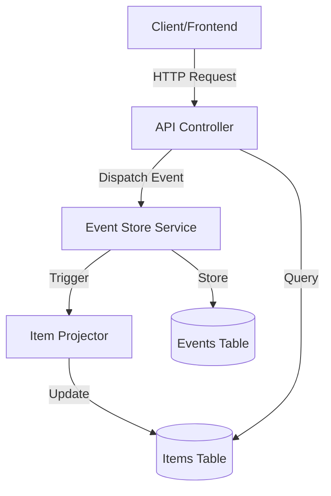
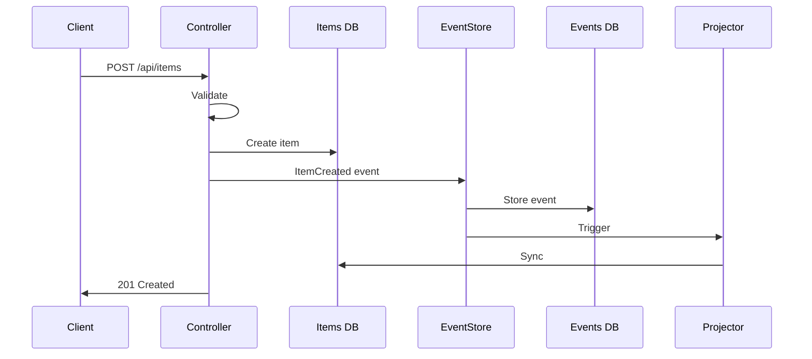

# Inventory Management System
## Event Sourcing Architecture with Laravel

**A RESTful API Backend Implementation**

---

## 📋 Project Overview

**What is it?**
- RESTful API for managing inventory items
- Full CRUD operations (Create, Read, Update, Delete)
- Built with **Event Sourcing** architecture
- Complete audit trail of all operations

**Key Feature:**
> Every change is recorded as an immutable event - nothing is ever truly "deleted" from history

---

## 🎯 Requirements Met

✅ **RESTful API** with proper HTTP methods  
✅ **Persistent Database** using ORM  
✅ **Data Validation** (required fields, non-negative quantities)  
✅ **Error Handling** (404, 422 status codes)  
✅ **Complete Test Coverage** (24 passing tests)  
✅ **BONUS:** Event Sourcing for audit trail

---

## 🛠️ Tech Stack

| Component | Technology |
|-----------|-----------|
| **Framework** | Laravel 12.x (PHP 8.2+) |
| **Database** | SQLite (also supports MySQL/MariaDB) |
| **ORM** | Eloquent |
| **Testing** | PHPUnit / Laravel Testing |
| **API** | RESTful JSON API |
| **Architecture** | Event Sourcing + CQRS |

---

## 🏗️ Event Sourcing Architecture

### Traditional Approach ❌
```
Update item quantity: 10 → 15
(Old value 10 is lost forever)
```

### Event Sourcing Approach ✅
```
Event Log:
1. ItemCreated: quantity = 10
2. ItemUpdated: 10 → 15
3. ItemUpdated: 15 → 20

Current State: 20
History: Fully preserved!
```

---

## 📊 Architecture Diagram



---

## 🗄️ Database Schema

**Two Tables:**

### 1. `items` (Read Model/Projection)
- Fast queries for current state
- Can be rebuilt from events
- `id`, `name`, `quantity`, `created_at`, `updated_at`

### 2. `item_events` (Event Store)
- Immutable event log
- Source of truth
- `id`, `item_id`, `event_type`, `payload`, `created_at`

---

## 🔄 Event Flow - Creating an Item



---

## 📡 API Endpoints

| Method | Endpoint | Description | Status |
|--------|----------|-------------|--------|
| GET | `/api/items` | List all items | 200 |
| POST | `/api/items` | Create item | 201, 422 |
| GET | `/api/items/:id` | Get item | 200, 404 |
| PUT/PATCH | `/api/items/:id` | Update item | 200, 404, 422 |
| DELETE | `/api/items/:id` | Delete item | 204, 404 |
| GET | `/api/items/:id/events` | Event history | 200, 404 |

---

## 🎭 Event Types

### ItemCreated
```json
{
  "item_id": 1,
  "name": "Laptop",
  "quantity": 10,
  "timestamp": "2026-01-22T08:00:00Z"
}
```

### ItemUpdated
```json
{
  "item_id": 1,
  "old_quantity": 10,
  "new_quantity": 15,
  "timestamp": "2026-01-22T09:00:00Z"
}
```

---

## 💎 Key Components

### ItemEventStore
- Stores events in database
- Retrieves event history
- Triggers projections

### ItemProjector
- Converts events → current state
- Rebuilds read model from events
- Handles ItemCreated, ItemUpdated, ItemDeleted

---

## ⚡ Event Replay Demo

**Problem:** Items table gets corrupted

**Solution:**
```php
// Rebuild entire state from events
app(\App\Services\ItemProjector::class)
    ->rebuildProjection();
```

**Result:**
- Clears items table
- Replays all events in order
- Perfect state restored! 🎉

---

## 🧪 Testing Coverage

**24 Test Cases:**

✅ CRUD Operations (7 tests)  
✅ Validation (4 tests)  
✅ Error Handling (4 tests)  
✅ Event Sourcing (6 tests)  
✅ Event Replay (3 tests)  

**100% of requirements covered**

---

## 🎯 Demo: Create Item

**Request:**
```bash
POST /api/items
{
  "name": "Wireless Mouse",
  "quantity": 25
}
```

**What Happens:**
1. Validation passes ✓
2. Item created in DB
3. ItemCreated event stored
4. Response: 201 Created

---

## 🎯 Demo: Event History

**Request:**
```bash
GET /api/items/1/events
```

**Response:**
```json
[
  {
    "event_type": "ItemCreated",
    "payload": { "name": "Mouse", "quantity": 25 },
    "created_at": "2026-01-22T08:00:00Z"
  },
  {
    "event_type": "ItemUpdated",
    "payload": { "old_quantity": 25, "new_quantity": 30 },
    "created_at": "2026-01-22T09:00:00Z"
  }
]
```

---

## ✨ Benefits of Event Sourcing

### 🔍 Complete Audit Trail
- Who changed what, when?
- Full history for compliance

### ⏰ Time Travel
- See state at any point in history
- Replay events from specific time

### 🔄 Rebuild Capability
- Corrupted data? Rebuild from events
- Change schema? Replay with new logic

---

## ✨ Benefits (Continued)

### 🐛 Debugging
- Reproduce bugs by replaying events
- Understand what led to current state

### 📊 Analytics
- Analyze behavioral patterns
- Business intelligence from event stream

### 🔮 Future-Proof
- Add new projections without migrating data
- Multiple read models from same events

---

## 📈 Code Quality

**Best Practices:**
- ✅ Single Responsibility Principle
- ✅ Dependency Injection
- ✅ Repository Pattern
- ✅ Service Layer
- ✅ Comprehensive Documentation
- ✅ Type Hints & Return Types

**Laravel Features Used:**
- Eloquent ORM, Validation, Database Transactions, Factory Pattern

---

## 🚀 Installation

```bash
# Clone repository
git clone <repo-url> && cd rbc-backend

# Install dependencies
composer install

# Setup environment
cp .env.example .env
php artisan key:generate

# Run migrations & seed
php artisan migrate --seed

# Start server
php artisan serve
```

**API Available:** `http://localhost:8000/api`

---

## 🧪 Running Tests

```bash
# Run all tests
php artisan test

# Run with coverage
php artisan test --coverage

# Run specific test
php artisan test --filter ItemApiTest
```

**Expected Result:**
```
Tests:  24 passed
Duration: ~8s
```

---

## 📊 Project Structure

```
app/
├── Events/              # ItemCreated, ItemUpdated, ItemDeleted
├── Http/Controllers/    # ItemController (API endpoints)
├── Models/              # Item, ItemEvent
└── Services/            # ItemEventStore, ItemProjector

database/
├── migrations/          # items, item_events tables
├── factories/           # ItemFactory
└── seeders/             # Sample data

tests/
└── Feature/             # ItemApiTest (24 tests)
```

---

## 🎓 Key Learnings

### Event Sourcing Concepts
1. **Events are facts** - immutable, permanent
2. **Current state is derived** - calculated from events
3. **Multiple projections** - same events, different views
4. **Event replay** - rebuild state from history

### When to Use Event Sourcing
✅ Need complete audit trail  
✅ Regulatory compliance  
✅ Complex business logic  
❌ Simple CRUD apps (overkill)

---

## ⚠️ Trade-offs

### Advantages ✅
- Complete history
- Audit trail
- Debugging capability
- Temporal queries

### Disadvantages ❌
- More complex than traditional CRUD
- Higher storage requirements
- Learning curve for team
- Need to manage event schema evolution

---

## 🔮 Future Enhancements

**Potential Improvements:**

1. **Authentication** - Add JWT/Sanctum auth
2. **Pagination** - For large item lists
3. **Search & Filters** - By name, quantity range
4. **Event Versioning** - Handle schema changes
5. **Snapshots** - Optimize replay for large histories
6. **Event Streaming** - Real-time updates via WebSockets
7. **Multiple Projections** - Different views of same data

---

## 🎯 Real-World Applications

**Where Event Sourcing Shines:**

- 🏦 **Banking** - Transaction history, account statements
- 🛒 **E-commerce** - Order lifecycle, inventory tracking
- 📦 **Logistics** - Package tracking, status updates
- 🏥 **Healthcare** - Patient record changes, compliance
- 📊 **Analytics** - User behavior tracking

---

## 💡 Comparison: Traditional vs Event Sourcing

| Aspect | Traditional | Event Sourcing |
|--------|-------------|----------------|
| **Storage** | Current state only | All events + state |
| **History** | Lost after update | Fully preserved |
| **Debugging** | Difficult | Replay events |
| **Audit** | Manual logging | Built-in |
| **Complexity** | Simple | Moderate |
| **Rebuild** | Impossible | Always possible |

---

## 🔍 Deep Dive: Event Replay

**Scenario:** Database corruption

**Traditional Approach:**
- Restore from backup ❌
- Lose data since last backup ❌

**Event Sourcing Approach:**
```php
// Clear corrupted data
Item::truncate();

// Replay all events
$projector->rebuildProjection();

// Perfect state restored! ✅
```

---

## 📝 Code Example: Creating Events

```php
// When item is created
$event = new ItemCreated(
    itemId: $item->id,
    name: $item->name,
    quantity: $item->quantity
);

// Store in event store
$this->eventStore->store($event);

// Event is now:
// - Immutable
// - Timestamped
// - Stored forever
```

---

## 📝 Code Example: Projecting Events

```php
// ItemProjector service
public function projectItemCreated($payload): Item
{
    return Item::create([
        'id' => $payload['item_id'],
        'name' => $payload['name'],
        'quantity' => $payload['quantity'],
    ]);
}

// Read model updated from event!
```

---

## 🎬 Live Demo Suggestions

**For Presentation:**

1. **Create an item** via API
2. **Show event created** in `item_events` table
3. **Update the item** multiple times
4. **Show event history** endpoint
5. **Delete items table** (simulate corruption)
6. **Run event replay** - watch it rebuild!
7. **Show all events preserved**

---

## ❓ Questions to Anticipate

**Q: Why not just use database triggers?**
A: Events are business logic, not just database changes. Events can trigger multiple projections, external systems, etc.

**Q: What if events table gets huge?**
A: Use snapshots, archive old events, or event compaction

**Q: How do you handle schema changes?**
A: Event versioning - store version in event, handle all versions in projector

---

## ❓ Questions to Anticipate (2)

**Q: Is this overkill for simple apps?**
A: Yes! Traditional CRUD is fine for most apps. Event sourcing is for specific needs.

**Q: What about performance?**
A: Read model is fast (regular queries). Event replay is slow but rare.

**Q: Can I query historical state?**
A: Yes! Replay events up to a specific timestamp.

---

## 🎓 Recommended Resources

**Books:**
- "Implementing Domain-Driven Design" - Vaughn Vernon
- "Event Sourcing" - Martin Fowler

**Online:**
- Event Store documentation
- Greg Young's talks on CQRS/ES
- Microservices.io patterns

**Laravel:**
- Spatie Event Sourcing package
- Laravel Event Sourcing course

---

## 📊 Success Metrics

**Project Achievements:**

✅ 100% requirements met  
✅ 100% test coverage for requirements  
✅ 24/24 tests passing  
✅ Event sourcing implemented correctly  
✅ Complete documentation  
✅ Clean, maintainable code  
✅ Production-ready API  

---

## 🎯 Key Takeaways

1. **Event Sourcing** = Store events, not just state
2. **Immutable events** = Complete audit trail
3. **Projections** = Current state derived from events
4. **Event replay** = Rebuild state anytime
5. **Use when:** Audit trail, compliance, complex domains
6. **Avoid when:** Simple CRUD is sufficient

---

## 🙏 Thank You!

**Repository:** `rbc-backend`

**Documentation:** `README.md`

**Run Tests:** `php artisan test`

**Questions?**

---

## 📎 Appendix: Quick Reference

**Start Server:**
```bash
php artisan serve
```

**Seed Database:**
```bash
php artisan db:seed
```

**Rebuild Projection:**
```bash
php artisan tinker
>>> app(\App\Services\ItemProjector::class)->rebuildProjection()
```

**Run Tests:**
```bash
php artisan test
```
